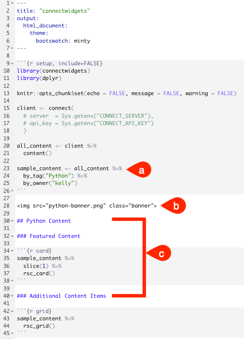

---
output:
  pdf_document:
    latex_engine: xelatex
    includes:
      in_header: template_files/header.tex
  html_document:
    toc: yes
    toc_float: yes
    highlight: pygments
    includes:
      in_header: template_files/header.html
      after_body: template_files/footer.html
geometry: left=1cm,right=1cm,top=6cm,bottom=2.4cm
classoption:
- twocolumn
# mainfont: sourcesanspro
# sansfont: sourcesanspro
# monofont: sourcecodepro
header-includes:
- \usepackage[default]{sourcesanspro}
---
\fancyfoot[L]{\fontsize{8}{8}\selectfont Version 1.0}


```{r setup, include=FALSE}
knitr::opts_chunk$set(echo = TRUE)
```

# Custom landing page with `connectwidgets`

*Authored By Ashley Henry - Technical Writer*

## When you want to share deployed content as a cohesive project

* How do you make sure your audience finds what they need on RStudio Connect without having to page through the dashboard, remember the right search terms, or bookmark every content item you share?
* How do you share related deployments as a cohesive project?

You can use one of Connect's content curation tools - `connectwidgets`{.R} - used to build a customized landing page to share with your audience.

## What is `connectwidgets`{.R}

`connectwidgets`{.R} is an RStudio-maintained R package that can be used to query a Connect server for a subset of your existing content items, then organize them within `htmlwidgets`{.R} in an R Markdown document or Shiny application.

This guide walks you through:

* installing `connectwidgets`{.R}
* updating the `connectwidgets`{.R} template and deploying to Connect
* adding custom CSS
* configuring a vanity URL for your `connectwidget`{.R} dashboard
* configuring `RootRedirect`{.R} so your audience is automatically redirected to your `connectwidgets`{.R} dashboard 

## Requirements

* Have RStudio Connect v1.9.0, or higher
* You will need to have administrative privileges to access and edit the RStudio Connect's configuration to customize the following:
    + [`RootRedirect` URL](https://docs.rstudio.com/connect/admin/appendix/configuration/#Server.RootRedirect)

## Prework

### API Keys

If you've previously added API Keys to your `.Renviron`{.R} file as environment variables, please continue to the next section ([`connectwidgets`{.R}](#connectwidgets)).

API Keys let us make authenticated requests from the RStudio IDE to RStudio Connect.

We are going to add our API credentials to a `.Renviron`{.R} file, making them available to R as environment variables.

* Navigate to Connect and create and copy your API Key.
* Return to the RStudio IDE.
* Use an `.Renviron`{.R} file to set the `CONNECT_SERVER`{.R} and `CONNECT_API_KEY`{.R} environment variables:
    + In the Console, type `usethis::edit_r_environ()`{.R} \hyphenpenalty 10000 and press **Enter** to open your .Renviron for editing.
    + Add the following:

\vspace{2truemm}
```{r eval=FALSE}
CONNECT_SERVER=<https://your-server-address.com/>
CONNECT_API_KEY=<paste key value>
```
\vspace{1truemm}

* Save and close the file.
* Restart R:
    + Mac: **Command** + **Shift** + **F10**
    + PC/Linux: **Ctrl** + **Shift** + **F10**

# `connectwidgets`

## Install `connectwdigets`

You can either install from CRAN or install from GitHub:

* **Install from CRAN:**
  + Install `connectwidegets` and load the library: 

```{r eval=FALSE}
install.packages("connectwidgets")
library(connectwidgets)
```
\vspace{2truemm}
* **Install from GitHub:**

```{r eval=FALSE}
# This is the development version
# install.packages("remotes")
remotes::install_github("rstudio/connectwidgets")
library(connectwidgets)
```

# The template

`connectwidgets`{.R} offers a built-in template that is easy to use and edit to get you started.

**What does the template do?**

The template supplies intro code chunks that:

* Load `dplyr`{.R}, which will be used to create a subset of content from the server that you want to display.
*  Establish a connection to the server by using the environment variables `CONNECT_SERVER`{.R} and `CONNECT_API_KEY`{.R}.
* Pulls down all of the content that you have access to on the Connect server.
* Creates a `sample_content`{.R} variable that slices a set number of content items.

Additionally, you can configure a theme, add custom CSS, and select the components that you wish to display.
    
**To use the template:**

* From the RStudio IDE, open a new R Markdown file: **File** > **New File** > **R Markdown...**.
* In the left pane, click **From Template**, select **connectwidgets (HTML)** and click **OK**.
* **Knit** the template.

*Here is an example of the knitted output:*

{width=20%}

**Why aren't the thumbnails of the content displaying?**

Unfortunately, the thumbnails for the content will not display in development because:
     
* That request cannot be made cross-origin. However, the actual content thumbnails will be pulled once the page is deployed to Connect.
* You do not have permission to view the images.
* An image has not been set.
    

In the knitted output, you will notice that your data is grouped by *Component*.

`connectwidgets`{.R} has different types of components, shown above, to display information about your filtered content data:

* card
* grid
* table
* search & filter *(not shown in image above)*

For a full description of these components, please see the [`connectwidgets`](https://rstudio.github.io/connectwidgets/?_ga=2.210796374.2138389167.1634566916-1136239596.1630433953#components) documentation.

### Edit the template

Now, we have gotten to the point where we are ready to edit the template, configure theming, and add customizations.

Don't forget to Knit to apply your changes to the template.

* Feel free to update the `title` of the template documentation.
* Set the theme:
    + You can set your theme by supplying a [Bootswatch theme](https://bootswatch.com/4/), such as `minty`{.R}, in the YAML header of the template:
  
```{r eval=FALSE}
---
title: "connectwidgets" #for example
output:
  html_document:
    theme:
      bootswatch: minty
---
```
\newpage
*Here is a sample output of the `minty` theme:*

{width=20%}


### Customize and choose your displayed content:

a. Select the content to use/display by adding two helper functions to select content: `by_tag`{.R} and `by_owner`{.R}:
  + Assuming that you don't want to display a random set of content, for this example, we are going to filter by content tagged as "Python" and owned by user "kelly".
  + Delete the `table`{.R} and `search & filter`{.R} component entries from your template. Now, only the `card`{.R} and `grid`{.R} components display.
b. You may also replace the stock image with an image of your own.
c. Additionally, customize the headers for each component.



\newpage

* If you replaced the stock image with an image of your own that isn't web-based, then add the following to the YAML header:
  + Add [`rmd_output_metadata`](https://docs.rstudio.com/connect/user/rmarkdown/#how-to-work-with-output-files) and [`resource_files`](https://docs.rstudio.com/connect/user/rmarkdown/#r-markdown-resource-files):

{width=35%}

Replace the section of the template below with the sample:

```{r eval=FALSE}
library(connectwidgets)
library(dplyr)

knitr::opts_chunk$set(echo = FALSE, message = FALSE, 
                      warning = FALSE)

client <- connect(
# server  = Sys.getenv("CONNECT_SERVER"),
# api_key = Sys.getenv("CONNECT_API_KEY")
)

all_content <- client %>%
content()

sample_content <- all_content %>%
  by_tag("") %>%
  by_owner("")
```

*Make sure you set `by_tag("")`{.R} and `by_owner("")`{.R} with properties from your own Connect server.*


### Custom CSS

Now, we can take customization a step further and add CSS:

* This CSS:
    + Adds a solid border to the bottom of the title.
    + Adds an image to the left of the title.
    + Styles the banner image and applies a background color, gradient, padding, and position.
        

\newpage

Add the following CSS section to the template:

```{css}
{css, echo=FALSE}

.title {
margin-top: 50px;
padding-bottom: 20px;
padding-left: 85px;
background-image: url("connect-widgets.png");
background-size: auto 64px;
background-repeat: no-repeat;
background-image: left-align;
}


img.banner {
background-color: #303030;
padding-left: 550px;
padding-top: 50px;
padding-bottom: 50px;
backrgound-position: right;
background-image: linear-gradient
  (to left, #303030 40%, white);
}
```

*Here is an example of the rendered output including all of our customizations:*

{width=20%}

Lastly, let's compare the default template vs. the template that has a theme and our custom CSS changes applied:

{width=50%}

# Publish your content to Connect

* Once you are happy with your `connectwidgets` customizations in the RStudio IDE, publish  your content to RStudio Connect.

Let's recap!

* You've installed `connectwidgets`
* You've selected the components that you wish to display
* Your template is customized
* You've successfully published your content to Connect

# A custom dashboard

Instead of the default Connect dashboard, imagine that you want your users to see a *pretty* curated dashboard that is built with your `connectwidgets` project/app after logging into Connect.

Setting the vanity URL path of your content with `RootRedirect` allows you to do that! E.g.: `RootRedirect ="/pretty-dashboard"`

This is a great way to showcase your pieces of related content and share them as a cohesive project.

To learn more about `RootRedirect` before continuing, please see the [`RootRedirect`](https://docs.rstudio.com/connect/admin/appendix/configuration/#Server.RootRedirect) section in the Admin Guide.

## Vanity URL

* Navigate to your Connect server's dashboard and open your published `connectwidgets` content.
* Select the **Access** panel, set a unique **Content URL** and save your changes.

{width=30%}

To learn more, see the [Custom Content URL](https://docs.rstudio.com/connect/user/content-settings/#custom-url) section in the User Guide.


# `RootRedirect`

**Requires Role: Administrator**

This section has procedures that require you to have administrative privileges to edit the RStudio Connect configuration. If you have not been granted these privileges, please coordinate someone in your organization that is an administrator.

* Navigate to the
`/etc/rstudio-connect/rstudio-connect.gcfg` file.
* To set `RootRedirect`, update the `etc/rstudio-connect/rstudio-connect.gcfg` file using the example below:

```{block}
[Server]
RootRedirect ="/pretty-dashboard"
```

The `/pretty-dashboard` value is the same path that you used in the previous section for your Content URL.

* Save your changes and restart your server:

```{block}
systemctl restart rstudio-connect
```

Now, when anyone navigates to your Connect Server's URL, they are redirected to the `RootRedirect` path which points to your `connectwidgets` content that is hosted at the vanity URL path.

{width=30%}

# `DashboardPath`

Wait! You may be wondering, how do I navigate to the Connect dashboard since the `RootRedirect` brings you to your `connectwidgets` landing page?

You can configure `DashboardPath` which is the URL path to where your RStudio Connect's dashboard is hosted, allowing you to continue to access the dashboard.

* Navigate to the  `/etc/rstudio-connect/rstudio-connect.gcfg` file.
* To set `DashboardPath`, update the `etc/rstudio-connect/rstudio-connect.gcfg` file using the example below:

```{block}
[Server]
DashboardPath ="/connect/dashboard"
```

* Save your changes and restart your server:

```{block}
systemctl restart rstudio-connect
```

* Now, open a browser and navigate to your Connect server's IP using the `DashboardPath` that you configured above: http://<span></span>your-connect-server-address:3939/connect/dashboard/