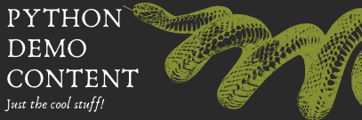

```{css, echo=FALSE}

.title {
margin-top: 50px;
padding-bottom: 20px;
padding-left: 85px;
background-image: url("connect-widgets.png");
background-size: auto 64px;
background-repeat: no-repeat;
background-image: left-align;
}


img.banner {
background-color: #303030;
padding-left: 550px;
padding-top: 50px;
padding-bottom: 50px;
backrgound-position: right;
background-image: linear-gradient(to left, #303030 40%, white);
}
```

```{r setup, include=FALSE}
library(connectwidgets)
library(dplyr)

knitr::opts_chunk$set(echo = FALSE, message = FALSE, warning = FALSE)

client <- connect(
# server  = Sys.getenv("CONNECT_SERVER"),
# api_key = Sys.getenv("CONNECT_API_KEY")
)

all_content <- client %>%
content()

sample_content <- all_content %>%
by_tag("Python") %>%
by_owner("ashley")
```




## Python Content

### Featured Content

```{r card}
sample_content %>%
slice(1) %>%
rsc_card()
```

### Additional Content Items

```{r grid}
sample_content %>%
rsc_grid()
```
